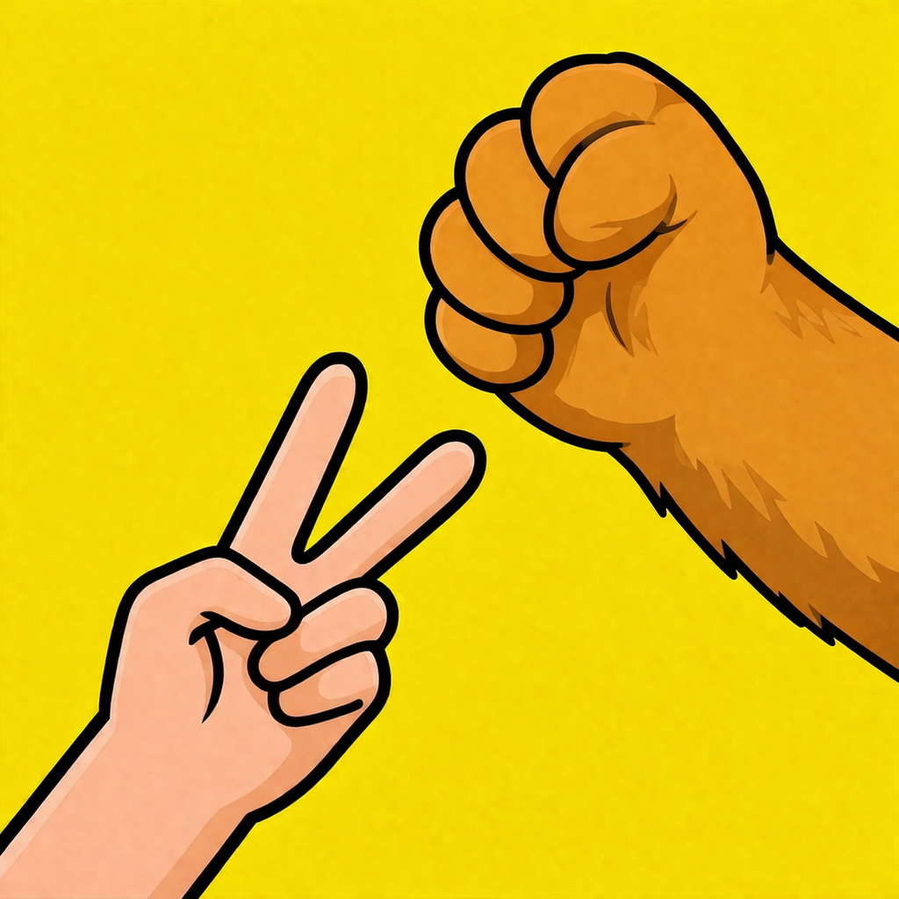

# Rock Paper Scissors - Hand Gesture Edition 🖐️

[](https://developer.apple.com/xcode/swiftui/)
[](https://developer.apple.com/ios/)
[](LICENSE)

<p align="Left">
  
</p>
## 🎮 Player Modes

**Three exciting play modes accessible from EntranceView:**

- **P1vsAI**: Player 1 uses hand gestures (camera) vs local AI opponent (random moves).
- **P1vsB**: Player 1 uses hand gestures vs remote **Bear** player (button inputs over RTC).
- **BvsP1**: Local **Bear** (button selector) vs remote Player 1 (gestures over RTC).

**B (Bear)** represents a player who simply presses buttons to choose Rock/Paper/Scissors instead of performing finger gestures.

**Real-time multiplayer powered by fully implemented RTC (Agora SDK)!**

A real-time **Rock Paper Scissors** game built with **SwiftUI** and **Core ML** for iOS. Play against an AI opponent using your **hand gestures** captured by the front-facing camera—no taps required!

## 🎮 Overview

Detects **Rock**, **Paper**, or **Scissors** hand poses in real-time using a trained ML model. The first gesture triggers a **3-second countdown**, then competes against the AI's random move. Complete with smooth animations and effects!

**Player 1:** You (camera gestures)  
**Player 2:** AI opponent

## ✨ Features

- **Three Player Modes**: P1vsAI, P1vsB, BvsP1 (local AI or remote RTC multiplayer)
- **Real-Time Communication (RTC)**: Fully implemented with Agora SDK for remote play
- **Real-time Hand Pose Recognition** via `RockPaperScissorClassifier.mlmodel` and `AVCaptureSession`
- **Camera Permissions & Error Handling** (front camera only)
- **3-Second Countdown Timer** on first detected gesture
- **AI Opponent** with random moves
- **Visual Feedback:**
  - **Win:** Confetti explosion on your area!
  - **Lose:** Pink tint overlay
  - **Tie:** Full-screen \"TIE!\" marquee effect
  - Shuffling animation for AI move reveal
- **Game State Management** with `GameViewModel` + `GameController`
- **Unit Tests** for game logic
- **Optimized Views:** `PlayerCameraAreaView`, `AIPlayerAreaView`, `ResultBoxView`

## 📱 Demo

<!-- Add a screen recording GIF here! Example: -->
<!--  -->

1. Show hand to camera → Gesture detected → Countdown
2. Hold pose → AI shuffles → Outcome revealed with effects!

## 🛠️ Setup & Run

1. Clone the repo:
   ```bash
   git clone https://github.com/yourusername/RockPaperScissors.git
   cd RockPaperScissors
   ```

2. Open in **Xcode**:
   ```
   open RockPaperScissors.xcodeproj
   ```

3. Select a physical device or an **iOS Simulator** with camera support.

4. **Build & Run** (⌘R)

5. **Grant Camera Permission** when prompted.

**Requirements:** iOS 17+, Xcode 15+

### 🔑 Realtime Multiplayer Setup

To enable the Realtime two player mode (P1vsB / BvsP1 modes), you need to configure the `Secrets.xcconfig` file:

1. Copy the provided template file:
   ```
   # The repository includes Secrets.xcconfig template
   ```

2. Edit `Secrets.xcconfig` and add your values:
   ```xcconfig
   // Get App ID from https://console.agora.io/
   AGORA_APP_ID = your_agora_app_id_here

   // Optional: Token server URL for production usage
   AGORA_TOKEN_SERVER_URL = https://your-token-server.example.com
   ```

> ⚠️ Without these values configured, the Realtime multiplayer modes will not work. You can still use the local P1vsAI mode without any secrets configuration.

## 🏗️ Project Structure

```
RockPaperScissors/
├── View/                 # SwiftUI Views
├── ViewModel/            # Observable ViewModels
├── Model/                # HandMove enum
├── Controller/           # GameController, RoundStateMachine
├── RockPaperScissors.xcodeproj
└── Tests/
```

## 🚀 Future Roadmap

- **✅ Real-Time Communication (RTC)**: Fully implemented with Agora SDK
- **Advanced AI Player**: Smarter opponent (learn from user patterns, difficulty levels)
- **Custom Gestures & Themes**
- **Game Stats & Leaderboards**
- **Share Replay Feature**
- **macOS Catalyst Support**

Contributions welcome! See [TODO.md](TODO.md) for recent completions (e.g., special effects ✅).

## 🤝 Contributing

1. Fork & clone
2. Create feature branch: `git checkout -b feature/AmazingFeature`
3. Commit: `git commit -m 'Add amazing feature'`
4. Push & PR!

## 📄 License

MIT License - see [LICENSE](LICENSE) (add one if missing).

---

**Built with ❤️ using SwiftUI, Vision, Core ML by @chengr**
